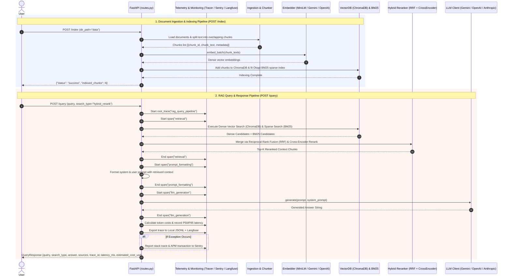

# RAG Full Version

A production-ready, modular Retrieval-Augmented Generation (RAG) system built from **First Principles** with clean Python architecture.

---

## 🎯 Architectural Philosophy: First-Principles over Heavy Frameworks

This project intentionally avoids heavy wrapper abstractions (like LangChain or LlamaIndex) in favor of **First-Principles AI Engineering**:

* **🔍 Full Transparency & Zero "Black Box"**: Every algorithm—from Okapi BM25 scoring and Reciprocal Rank Fusion (RRF) to cross-encoder re-ranking and semantic caching—is implemented natively without layers of obscure wrapper classes.
* **⚡ High Performance & Low Latency**: Native Python and direct official SDKs eliminate framework overhead, resulting in sub-millisecond local execution and lightning-fast test suites.
* **🛠️ Production Debuggability**: Traceability is straightforward: no hidden prompt injections, memory leaks, or unhandled exceptions buried deep within third-party abstractions.
* **🔌 Framework-Agnostic & Agent-Ready**: Every module is a typed, standalone component that can easily plug into orchestration frameworks (e.g., LangGraph, AutoGen) if complex cyclic workflows are needed.

## 🔄 End-to-End Workflow & System Architecture

Here is the exact flow of data and component execution across the two main pipelines: **Document Ingestion** and **RAG Query Execution**.

### 📊 System Workflow Diagram



### ⚙️ Step-by-Step Breakdown

#### 1. Ingestion & Indexing Phase (`POST /index`)
1. **Document Loading**: `DocumentLoader` scans the target folder and parses supported file formats (`.pdf`, `.txt`, `.csv`, `.md`, `.docx`).
2. **Text Chunking**: `TextChunker` splits documents into overlapping character chunks using configured separators.
3. **Dense Embedding Generation**: `Embedder` batch-calculates dense vector representations (e.g. 384-dimensional `all-MiniLM-L6-v2` embeddings).
4. **Dual Indexing**:
   * **Dense Vectors** are persisted to `ChromaDB` (or `FAISS`).
   * **Sparse Term Frequencies** are fitted into an `Okapi BM25` index for exact keyword matching.

#### 2. Querying & Generation Phase (`POST /query`)
1. **Tracing Started**: `Tracer` creates a unique `trace_id` for distributed observability.
2. **Hybrid Retrieval (`Retriever`)**:
   * Runs **Dense Vector Search** (semantic similarity) and **Sparse BM25 Search** (exact keyphrase match) in parallel.
   * **Reciprocal Rank Fusion (RRF)** combines both candidate lists into a unified score array.
   * **Cross-Encoder Reranker** scores the top candidates jointly with the query for maximum precision.
   * *(Optional)* **Context Compression** prunes redundant or noisy sentences.
3. **Prompt Formatting**: `format_rag_prompt()` injects top chunks into standard system instruction templates with source attribution tags.
4. **LLM Generation**: `LLMClient` calls the selected provider (`Gemini 2.0 Flash`, `OpenAI`, or `Anthropic`) to generate the final grounded response.

#### 3. Observability & Monitoring Phase
* **Langfuse Tracing**: Exports hierarchical trace trees (retrieval duration, prompt payload, generation latency, and token counts) to Langfuse.
* **Sentry Error Monitoring**: Intercepts unhandled ASGI exceptions and logs APM profiling sessions to Sentry.
* **Local JSONL Logging**: Appends execution logs locally in `logs/traces.jsonl`.

---

## 🗺️ 5-Phase Production Roadmap


The repository follows a structured 5-plan roadmap detailed in the [`plans/`](plans/) directory:

| Plan | Title | Status | Description |
| :--- | :--- | :---: | :--- |
| **[Plan 1](plans/plan1.md)** | **Advanced Hybrid Retrieval & Re-ranking** | ✅ Complete | Sparse BM25 + Dense Vector search with Reciprocal Rank Fusion (RRF), Cross-Encoder Re-ranking, and Contextual Sentence Compression. |
| **[Plan 2](plans/plan2.md)** | **Evaluation Engine (LLM-as-a-Judge)** | ⏳ Pending | Precision@K, Recall@K, Hit Rate, MRR, Faithfulness / Groundedness, and automated Golden Dataset benchmarking. |
| **[Plan 3](plans/plan3.md)** | **Failure Modes & Guardrails** | ⏳ Pending | Citation verification, statement entailment checks, and graceful fallback handling for out-of-domain queries. |
| **[Plan 4](plans/plan4.md)** | **Cost & Latency Optimization** | ⏳ Pending | Semantic vector query cache ($0 repeat cost), query complexity router (Flash vs. Pro), and token/latency profiler. |
| **[Plan 5](plans/plan5.md)** | **System Design & 100x Scaling (ADRs)** | ⏳ Pending | Architecture Decision Records (RAG vs. Fine-Tuning, 100x scale sharding), and Senior AI Interview Cheat Sheet. |

---

## 📁 Project Structure

```
Rag_Full_Version/
├── README.md                      # Project description, philosophy, and setup guide
├── requirements.txt               # Dependencies (FastAPI, ChromaDB, Google GenAI, etc.)
├── .env / .env.example            # Environment variables and API keys
├── .gitignore                     # Git ignore definitions
├── config.yaml                    # Central configuration file
├── AGENTS.md                      # Coding standards & agent instructions
├── main.py                        # Service entry point
├── plans/                         # Step-by-step engineering plans
│   ├── plan1.md                   # Plan 1: Hybrid Retrieval & Re-ranking (Done)
│   ├── plan2.md                   # Plan 2: Evaluation & Metrics Engine
│   ├── plan3.md                   # Plan 3: Failure Modes & Guardrails
│   ├── plan4.md                   # Plan 4: Cost & Latency Optimization
│   └── plan5.md                   # Plan 5: System Design & Scaling ADRs
├── .agents/
│   └── skills/
│       └── rag-conventions/
│           └── SKILL.md           # Custom skill for naming conventions and docstrings
├── src/
│   ├── ingestion/                 # Document ingestion (PDF, CSV, TXT, DOCX, MD)
│   │   ├── __init__.py
│   │   └── loader.py
│   ├── chunking/                  # Text chunking & sentence compression
│   │   ├── __init__.py
│   │   ├── chunker.py
│   │   └── compression.py
│   ├── embeddings/                # Vector embeddings (SentenceTransformers, OpenAI, Gemini)
│   │   ├── __init__.py
│   │   └── embedder.py
│   ├── vectordb/                  # Vector database (ChromaDB, FAISS, in-memory)
│   │   ├── __init__.py
│   │   └── vector_store.py
│   ├── retrieval/                 # Unified search engine & hybrid rankers
│   │   ├── __init__.py
│   │   ├── bm25_retriever.py      # Okapi BM25 keyword search
│   │   ├── hybrid_retriever.py    # Reciprocal Rank Fusion (RRF)
│   │   ├── reranker.py            # Cross-Encoder re-ranker
│   │   └── retriever.py           # Unified Retriever Facade
│   ├── prompts/                   # Prompt templates & context formatting
│   │   ├── __init__.py
│   │   └── prompt_templates.py
│   ├── llm/                       # LLM provider clients (Gemini, OpenAI, Anthropic)
│   │   ├── __init__.py
│   │   └── llm_client.py
│   ├── api/                       # FastAPI REST endpoints
│   │   ├── __init__.py
│   │   └── routes.py
│   └── utils/                     # Config loader, helpers, structured logger
│       ├── __init__.py
│       └── helpers.py
├── tests/                         # Unit & integration test suites
│   ├── __init__.py
│   ├── test_app.py
│   └── test_hybrid_retriever.py
└── logs/                          # Application log files
    └── .gitkeep
```

---

## 🚀 Getting Started

### 1. Installation

Create and activate a virtual environment, then install dependencies:

```bash
python -m venv .venv
# On Windows:
.venv\Scripts\activate
# On Linux/macOS:
source .venv/bin/activate

pip install -r requirements.txt
```

### 2. Configure Environment

Copy `.env.example` to `.env` and fill in your API keys:

```bash
cp .env.example .env
```

### 3. Run the Application

Start the FastAPI server:

```bash
python main.py
```

* API Docs (Swagger): `http://localhost:8000/docs`
* Health Check: `http://localhost:8000/health`

---

## 🧪 Running Tests

Run the test suite using `unittest` or `pytest`:

```bash
python -m unittest discover tests
# or
pytest -v
```

---

## 📐 Conventions & Standards

- **Naming**: `snake_case` for modules/functions/variables, `PascalCase` for classes, `UPPER_SNAKE_CASE` for constants.
- **Docstrings**: Concise Google-style Python docstrings for all functions, classes, and modules.
- **Rules & Skills**: Defined in [`AGENTS.md`](AGENTS.md) and [`.agents/skills/rag-conventions/SKILL.md`](.agents/skills/rag-conventions/SKILL.md).
