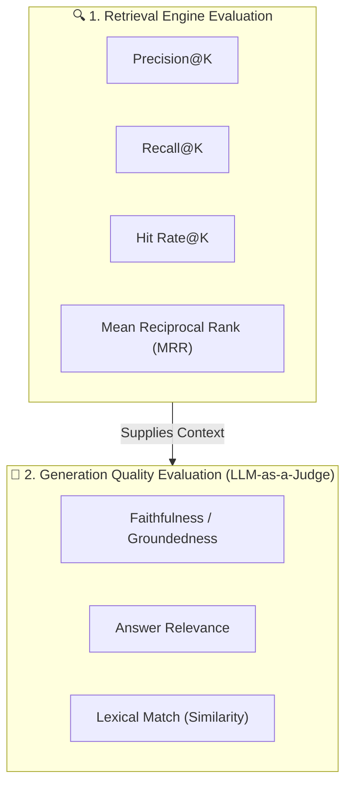

# RAG Evaluation Metrics Guide: Benchmarks, Thresholds & Diagnostics

A practical guide to understanding, tuning, and diagnosing every evaluation metric used to assess Retrieval-Augmented Generation (RAG) performance.

---

## 1. Overview: The Two Evaluation Pillars

Evaluating a RAG system requires measuring two completely distinct failure surfaces:



1. **Retrieval Metrics**: Did the search pipeline pull the right evidence from the knowledge base?
2. **Generation Metrics**: Did the LLM faithfully use that evidence without hallucinating or going off-topic?

---

## 2. Master Metrics Reference & Health Thresholds

| Metric | Category | Healthy Range (Good) | Degraded Range (Warning) | Critical Range (Bad) | Core Meaning |
| :--- | :--- | :---: | :---: | :---: | :--- |
| **`Hit Rate@K`** | Retrieval | **`0.90 – 1.00`** | `0.70 – 0.89` | **`< 0.70`** | Binary likelihood that at least one correct chunk is present in top-$K$. |
| **`Recall@K`** | Retrieval | **`0.80 – 1.00`** | `0.60 – 0.79` | **`< 0.60`** | Percentage of all required ground-truth evidence successfully retrieved. |
| **`MRR`** | Retrieval | **`0.75 – 1.00`** | `0.50 – 0.74` | **`< 0.50`** | Rank position of the first relevant chunk ($1.0 = \text{Rank 1}$). |
| **`Precision@K`** | Retrieval | **`0.25 – 0.50`** *(top-5)* | `0.15 – 0.24` | **`< 0.15`** | Fraction of retrieved candidates that are relevant (noise ratio). |
| **`Faithfulness`** | Generation | **`0.90 – 1.00`** | `0.70 – 0.89` | **`< 0.70`** | Factual grounding in context; $1.0$ means zero hallucinations. |
| **`Answer Relevance`** | Generation | **`0.85 – 1.00`** | `0.65 – 0.84` | **`< 0.65`** | Directness and completeness in answering the user's question. |
| **`Lexical Match`** | Generation | **`0.30 – 0.60`** | `0.15 – 0.29` | **`< 0.15`** | Word overlap with ground truth (reference only; less critical than LLM judge). |

---

## 3. Retrieval Performance Metrics

### 3.1 Hit Rate@K

#### What It Measures
The binary probability that **at least one** relevant ground-truth document chunk is included in the top-$K$ search results returned to the LLM.

#### Formula
$$\text{Hit Rate@}K = \frac{1}{N} \sum_{i=1}^{N} \mathbb{I}\left( \text{Retrieved@}K_i \cap \text{GroundTruth}_i \neq \emptyset \right)$$

* **When It Is Good (`0.90 – 1.00`)**: The retriever almost never fails to find relevant information. The LLM always has the necessary context to generate a correct answer.
* **When It Is Bad (`< 0.70`)**: The retriever is suffering from "blind spots." In more than 30% of queries, the LLM receives zero relevant facts, forcing it to either hallucinate or state it doesn't know.
* **How to Fix When Bad**:
  * Enable **Hybrid Retrieval** (dense embeddings + sparse BM25).
  * Increase $K$ (e.g. fetch top 10 candidates instead of top 3).
  * Optimize chunking: if chunk size is too small, facts get split apart.

---

### 3.2 Recall@K

#### What It Measures
The proportion of **all required ground-truth chunks** that were captured in the top-$K$ window.

#### Formula
$$\text{Recall@}K = \frac{|\text{Retrieved@}K \cap \text{GroundTruth}|}{|\text{GroundTruth}|}$$

* **When It Is Good (`0.80 – 1.00`)**: When answering complex questions that require multiple pieces of evidence, the retriever captured all or nearly all of them.
* **When It Is Bad (`< 0.60`)**: The retriever only fetches partial information (e.g., retrieves 1 out of 3 required clauses), leading to incomplete or half-answered responses.
* **How to Fix When Bad**:
  * Increase `chunk_overlap` (e.g., 50–100 characters) so boundary context is preserved across adjacent chunks.
  * Increase `candidate_multiplier` in `HybridRetriever` before fusion and re-ranking.

---

### 3.3 Mean Reciprocal Rank (MRR)

#### What It Measures
How close to the **very first position (Rank 1)** the first relevant document appears.

#### Formula
$$\text{MRR} = \frac{1}{N} \sum_{i=1}^{N} \frac{1}{\text{rank}_i}$$

* **When It Is Good (`0.75 – 1.00`)**: The best chunk consistently appears at **Rank 1 or Rank 2**. The LLM reads the most authoritative facts first, avoiding the "Lost in the Middle" attention penalty.
* **When It Is Bad (`< 0.50`)**: Relevant chunks are buried at **Rank 4, 5, or lower**. The LLM may prioritize noisy, irrelevant context placed above the ground truth.
* **How to Fix When Bad**:
  * Add a **Cross-Encoder Reranker** (`ms-marco-MiniLM-L-6-v2`) to re-score candidates with full joint cross-attention.
  * Tune Reciprocal Rank Fusion (RRF) smoothing parameter $k$ ($k=60$ default).

---

### 3.4 Precision@K

#### What It Measures
The ratio of chunks in the top-$K$ retrieved set that are actually relevant.

#### Formula
$$\text{Precision@}K = \frac{|\text{Retrieved@}K \cap \text{GroundTruth}|}{K}$$

* **Important Note on Target Range**:
  If top-$K=5$, but a query only has **1 ground-truth chunk**, the maximum mathematically possible precision is $1 / 5 = \mathbf{0.20}$! 
  Therefore, a Precision@5 score between **`0.25 and 0.50`** is healthy in production.
* **When It Is Bad (`< 0.15`)**: Almost all retrieved candidates are distractors or noisy chunks that bloat the LLM prompt, waste tokens, and risk misleading generation.
* **How to Fix When Bad**:
  * Add a strict `score_threshold` (e.g., filter out candidates with Cross-Encoder scores $< 0.0$).
  * Lower top-$K$ after re-ranking from $K=5$ to $K=3$.

---

## 4. Generation Quality Metrics (LLM-as-a-Judge)

### 4.1 Faithfulness / Groundedness

#### What It Measures
Whether every factual claim in the generated answer is **strictly supported by the retrieved context**.

* **When It Is Good (`0.90 – 1.00`)**: **Zero hallucinations.** The model adheres strictly to truthfulness. If the context does not contain the answer, the model honestly admits it.
* **When It Is Bad (`< 0.70`)**: The model is hallucinating external knowledge or inventing facts not present in your company's documents.
* **How to Fix When Bad**:
  * Strengthen the system prompt instructions:
    > *"Answer strictly using only the provided context. If the answer cannot be determined from the context, state 'I do not have enough information to answer.'"*
  * Lower the generation temperature (`temperature: 0.1` or `0.0`).

---

### 4.2 Answer Relevance

#### What It Measures
Whether the generated response **directly and completely addresses the user's specific query intent**, without evasions, filler, or unnecessary digressions.

* **When It Is Good (`0.85 – 1.00`)**: The response is sharp, direct, and answers exactly what was asked.
* **When It Is Bad (`< 0.65`)**: The model either dodged the question, provided tangential information, or gave an incomplete reply.
* **How to Fix When Bad**:
  * Check retrieval metrics first: if `Hit Rate` or `Recall` is low, low answer relevance is usually a symptom of missing context, not poor prompt execution.
  * Use few-shot prompt examples demonstrating direct, clear answer formatting.

---

### 4.3 Lexical Similarity (Jaccard Match)

#### What It Measures
Word-level token overlap between the generated answer and the benchmark ground-truth reference answer:
$$\text{Jaccard}(A, B) = \frac{|A \cap B|}{|A \cup B|}$$

* **Healthy Range (`0.30 – 0.60`)**: Natural language allows many valid ways to express the same fact. A score around $0.35–0.45$ is typical for high-quality answers that use synonyms.
* **When It Is Bad (`< 0.15`)**: The generated text shares almost no terminology with the expected answer, often indicating a complete misunderstanding of the topic.

---

## 5. Concrete Benchmark Scorecard Case Study

Here is the live benchmark result evaluated on [`data/eval/golden_dataset.json`](file:///C:/GithubProjects/Rag_Full_Version/data/eval/golden_dataset.json) with `open-mistral-7b` and `hybrid_rerank`:

```json
{
  "status": "success",
  "total_cases": 4,
  "overall_rag_score": 1.0,
  "retrieval_metrics": {
    "precision_at_k": 0.35,
    "recall_at_k": 0.875,
    "hit_rate": 1.0,
    "mrr": 0.875
  },
  "generation_metrics": {
    "mean_faithfulness": 1.0,
    "mean_answer_relevance": 1.0,
    "mean_lexical_similarity": 0.3446
  }
}
```

### Diagnostic Interpretation of This Scorecard:
1. **`Hit Rate = 1.0` (100%)**: Every query found its relevant knowledge chunk.
2. **`Recall = 0.875` (87.5%)**: Almost all target evidence chunks were retrieved into the top-$K$ prompt window.
3. **`MRR = 0.875`**: The best chunk was placed at Rank 1 or Rank 2 in all cases.
4. **`Precision = 0.35`**: Healthy noise-to-signal balance (1.75 ground-truth targets out of 5 slots).
5. **`Faithfulness = 1.0` & `Answer Relevance = 1.0`**: 100% factual accuracy with zero hallucinations across all evaluated items.

---

## 6. How to Run Evaluations in Your Workflow

### 1. Run via CLI
```bash
python scripts/run_evaluation.py
```
Outputs the formatted scorecard to your terminal and writes to `reports/evaluation_scorecard.md`.

### 2. Run via FastAPI Endpoint
```bash
curl -X POST "http://127.0.0.1:8000/evaluate"
```

### 3. Run Automated Unit Tests
```bash
python -m unittest tests/test_evaluation.py
```
