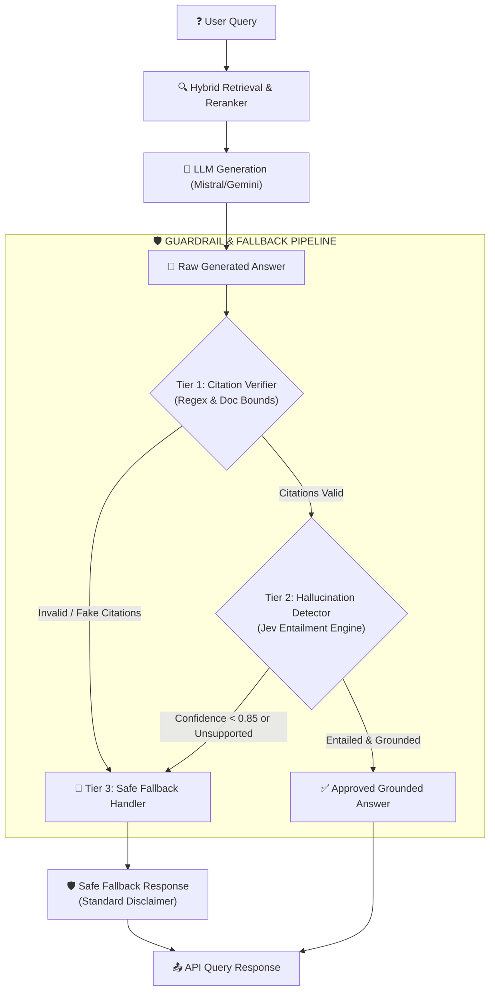

# Guardrails, Hallucination Detection & Fallback Engine Guide

A comprehensive architectural and operational guide explaining how the multi-tiered guardrail pipeline, **Jev** discriminative entailment engine, and fallback mechanism protect the RAG chatbot against hallucinations and fabricated citations.

---

## 1. Executive Summary

In a production RAG system, the primary question interviewers and users ask is:
> *"What happens when your model starts hallucinating or cites nonexistent sources?"*

Rather than relying on another expensive, slow generative LLM to "judge" answers in the serving path (which introduces seconds of user latency and doubles token spend), this project implements a **3-tier, low-latency discriminative guardrail architecture** powered by **Jev (TypeSafe AI / OpenRouter)**.



---

## 2. The Guardrail Chain: Step-by-Step

The guardrail pipeline executes immediately after raw LLM answer generation and before returning the payload to the API client:

### Step 1: Raw LLM Generation (`llm_generation` span)
The LLM generates a response formatted with citations based on retrieved context chunks:
```text
Photosynthesis converts light into chemical energy [1] using chlorophyll pigments [2].
```

### Step 2: Tier 1 — Citation Verification (`src/guardrails/citation_verifier.py`)
- **Execution Cost:** 0 ms latency, $0 token cost (pure deterministic regex & bounds check).
- **Checks Performed:**
  1. **Numeric Index Bounds:** Verifies that every numeric citation marker (`[1]`, `[2]`, etc.) maps to a valid 1-based index within the retrieved chunks. If the answer cites `[5]` but only 3 chunks were retrieved, it is marked as **invalid**.
  2. **Source Filename Matching:** Verifies that named source citations (`[Source: manual.pdf]`) strictly match the metadata filename of at least one retrieved chunk.
  3. **Output:** Produces a [`CitationVerificationResult`](file:///C:/GithubProjects/Rag_Full_Version/src/guardrails/citation_verifier.py#L12-L21) with `is_valid: bool`, `citation_score: float`, and lists of valid/invalid markers.

### Step 3: Tier 2 — Factual Claim Entailment (`src/guardrails/hallucination_detector.py`)
- **Claim Extraction:** Decomposes the answer into atomic propositions and factual sentences, filtering out conversational boilerplate (e.g., *"Based on the documents..."*, *"Sure, here is..."*).
- **Discriminative Entailment Verification:** Each claim is verified against the combined retrieved text using the **Jev** decision model ([`JevClient`](file:///C:/GithubProjects/Rag_Full_Version/src/guardrails/jev_client.py#L12-L135)).
- **Decision Engine Output:** Jev evaluates:
  $$\text{Query: "Is the statement strictly entailed and supported by the context reference?"}$$
  - Returns a calibrated confidence score ($0.0 \le p \le 1.0$) and a binary decision (`supported` vs. `unsupported`).
  - If a claim has confidence $< 0.85$ or is marked `unsupported`, it is flagged as a potential hallucination.
- **Output:** Produces a [`GroundingResult`](file:///C:/GithubProjects/Rag_Full_Version/src/guardrails/hallucination_detector.py#L13-L24) with `is_grounded: bool`, `grounding_score: float`, and lists of supported/unsupported claims.

### Step 4: Tier 3 — Policy Enforcement & Fallback Decision (`src/guardrails/fallback_handler.py`)
- Evaluates the joint outcome of Tier 1 and Tier 2 against configured policies:
  - If citations are valid AND all claims are grounded $\rightarrow$ **Action: `approved`**. The user receives the model's generated answer.
  - If any citation is fabricated OR an ungrounded claim is detected $\rightarrow$ **Action: `fallback_triggered`**. The raw answer is discarded and replaced with a verified safe response.

---

## 3. How the Fallback Runs & Rejection Mechanics

### 3.1 Trigger Conditions
The fallback handler activates when **any** of the following conditions occur:

| Trigger Scenario | Cause | Handler Action |
| :--- | :--- | :--- |
| **Out-of-Bounds Citation** | LLM references `[5]` when only 2 chunks exist | Triggers Fallback (`strict_mode: true`) |
| **Fabricated Source** | LLM cites `[Source: secret_memo.pdf]` which was never retrieved | Triggers Fallback |
| **Ungrounded Fact** | LLM introduces claims absent from context | Triggers Fallback |
| **Low Jev Confidence** | Claim entailment confidence $< 0.85$ | Triggers Fallback |
| **Empty Context** | Retriever returns 0 chunks | Triggers Fallback directly |

### 3.2 The Safe Fallback Response
When triggered, the system replaces potentially inaccurate answers with a standardized safe disclaimer:
> *"I cannot find sufficient factual backing in the retrieved documents to answer this question reliably. Please refer directly to the source documents."*

### 3.3 Audit Trail & Telemetry
Even when the fallback is triggered, the full incident is recorded in distributed tracing:
- Span: `"guardrail_verification"`
- Attributes:
  - `action`: `"fallback_triggered"`
  - `citation_score`: `0.5`
  - `grounding_score`: `0.0`
  - `reasons`: `["Citation verification failed: 1 invalid citation(s) found.", "Grounding check failed: 1 ungrounded claim(s)."]`
  - `engine`: `"jev"` (or `"heuristic_fallback"`)

---

## 4. Does It Always Run? (Control & Execution Rules)

### 4.1 Is It Always Active?
**Yes, by default for every `/query` request, but it is fully configurable.**

Its behavior is governed by [`config.yaml`](file:///C:/GithubProjects/Rag_Full_Version/config.yaml):

```yaml
guardrails:
  enabled: true                 # Master switch: set to false to bypass all guardrails
  citation_enforcement: true    # Enable regex & chunk index verification
  entailment_engine: "jev"      # Engine: "jev", "heuristic", or "mock"
  jev:
    model: "typesafe/jev"
    api_base: "https://api.typesafe.ai/v1"
    confidence_threshold: 0.85  # Minimum confidence required to accept claim
    timeout_seconds: 3.0
  fallback:
    strict_mode: true           # If true, reject response upon ANY ungrounded claim
    fallback_message: "I cannot find sufficient factual backing in the retrieved documents to answer this reliably."
```

### 4.2 Bypass & Mode Matrix

| `guardrails.enabled` | `fallback.strict_mode` | Behavior |
| :---: | :---: | :--- |
| `false` | *Any* | **Bypassed completely.** Raw LLM answer is returned immediately. |
| `true` | `true` (Default) | **Strict Protection.** Any citation mismatch or ungrounded claim triggers the safe fallback. |
| `true` | `false` | **Soft Warning.** Guardrail scores are logged and included in API telemetry, but raw answer is permitted. |

### 4.3 High-Availability Heuristic Fallback (Zero Downtime)
If the Jev API key (`JEV_API_KEY` or `OPENROUTER_API_KEY`) is not configured, or if the external API experiences a network timeout:
- The system **does not crash**.
- [`JevClient`](file:///C:/GithubProjects/Rag_Full_Version/src/guardrails/jev_client.py) automatically falls back to an offline token-overlap heuristic verification (`engine: "heuristic_fallback"`).
- Queries continue to be served and validated seamlessly with zero external API dependencies.

---

## 5. Architectural Comparison: Jev vs Generative LLM

Using a generative LLM (Mistral, GPT-4o, Claude) as an inline guardrail in RAG is an architectural anti-pattern for production traffic:

| Dimension | Generative LLM (Mistral / GPT-4o) | Discriminative Decision Model (**Jev**) |
| :--- | :--- | :--- |
| **Latency** | **1,500 – 3,500 ms** (must auto-regressively generate prose/JSON) | **70 – 500 ms** (fast discriminative forward pass) |
| **Cost** | **$0.15 – $5.00+** per 1M tokens | **$0.042** per 1M input tokens (unmetered output) |
| **Output Integrity** | Prone to markdown drift, invalid JSON syntax, prompt injection | Strictly bounded output schema (`choice`, `confidence`) |
| **Failure Mode** | Can hallucinate during its own verification | Deterministic classification over input state |

---

## 6. How It Is Integrated in the Codebase

### 6.1 API Pipeline Integration ([`src/api/routes.py`](file:///C:/GithubProjects/Rag_Full_Version/src/api/routes.py))
The guardrail is embedded as the 4th major span in the distributed trace:
1. `retrieval`
2. `prompt_formatting`
3. `llm_generation`
4. **`guardrail_verification`** (Citation check $\rightarrow$ Jev entailment $\rightarrow$ Fallback enforcement)

### 6.2 Extended Response Model
The [`QueryResponse`](file:///C:/GithubProjects/Rag_Full_Version/src/api/routes.py#L46-L56) includes explicit guardrail audit fields:

```json
{
  "query": "When was the Eiffel Tower built?",
  "search_type": "hybrid_rerank",
  "answer": "The Eiffel Tower was built in 1889 [1].",
  "sources": [...],
  "trace_id": "c1f75001-9a72-4c28-98e3-0c4a45a6b0c2",
  "latency_ms": 342.15,
  "estimated_cost_usd": 0.00018,
  "guardrail_status": "approved",
  "citation_score": 1.0,
  "grounding_score": 1.0
}
```

If the fallback is triggered, the response payload returns:
```json
{
  "query": "Who built the moon bases in 1920?",
  "search_type": "hybrid_rerank",
  "answer": "I cannot find sufficient factual backing in the retrieved documents to answer this reliably. Please refer directly to the source documents.",
  "sources": [...],
  "trace_id": "f8a12003-4b61-41e9-89d2-9a8c12b1d3e4",
  "latency_ms": 115.42,
  "estimated_cost_usd": 0.00012,
  "guardrail_status": "fallback_triggered",
  "citation_score": 0.0,
  "grounding_score": 0.0
}
```

---

## 7. How to Run and Test

### 7.1 Running the Server
Start the FastAPI server:
```bash
python main.py
```
Or via uvicorn directly:
```bash
uvicorn src.api.routes:create_app --factory --host 0.0.0.0 --port 8000 --reload
```

### 7.2 Executing a Query via cURL
```bash
curl -X POST "http://localhost:8000/query" \
     -H "Content-Type: application/json" \
     -d '{
       "query": "What are the supported document formats?",
       "search_type": "hybrid_rerank",
       "top_k": 3
     }'
```

### 7.3 Testing Programmatically in Python
```python
from src.guardrails.citation_verifier import CitationVerifier
from src.guardrails.hallucination_detector import HallucinationDetector
from src.guardrails.fallback_handler import FallbackHandler

verifier = CitationVerifier()
detector = HallucinationDetector()
handler = FallbackHandler(strict_mode=True)

docs = [{"chunk_text": "Python 3.13 introduces experimental free-threading.", "metadata": {"filename": "python_release.txt"}}]
answer = "Python 3.13 introduces free-threading [1]."

c_res = verifier.verify_citations(answer, docs)
g_res = detector.verify_grounding(answer, docs)
decision = handler.evaluate_and_enforce(answer, c_res, g_res)

print("Approved:", decision.approved)
print("Final Answer:", decision.final_answer)
```

### 7.4 Running Automated Tests
Run the comprehensive guardrail test suite:
```bash
pytest tests/test_guardrails.py -v
```

Run all tests across the repository:
```bash
pytest tests/ -v
```
