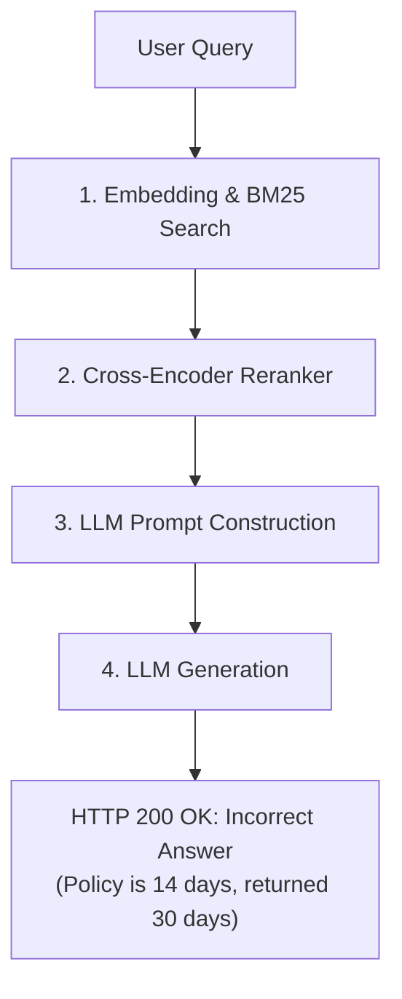
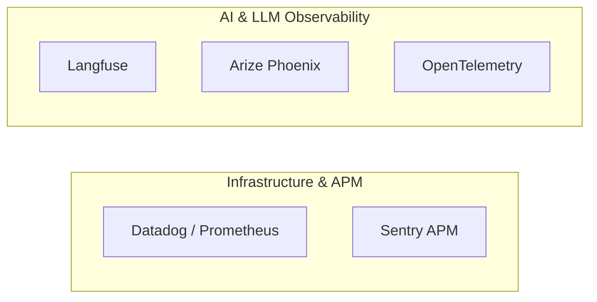

# Observability vs. Monitoring in Production RAG Systems

> *"Monitoring tells you when your system is broken; Observability tells you why it broke when everything appears to be working."*

---

## 1. Executive Summary

In traditional software engineering, a healthy application is one that returns `HTTP 200 OK` with low latency and low CPU utilization.

In **Retrieval-Augmented Generation (RAG)**, traditional health checks are completely insufficient. An AI system can return `HTTP 200 OK` in 150ms with zero server exceptions, yet deliver an answer that is **100% fabricated (hallucinated)**, cited from obsolete documents, or actively toxic.

To build production-grade RAG, you must implement two distinct but complementary layers:
1. **Operational Monitoring**: Measures infrastructure, latency, errors, token burn, and dollar costs.
2. **Semantic Observability**: Traces the internal reasoning graph, chunk rankings, embedding drift, and factual grounding.

---

## 2. Core Differences: Monitoring vs. Observability

| Feature | **Monitoring (Operational Health)** | **Observability (Semantic Reasoning Health)** |
| :--- | :--- | :--- |
| **Primary Goal** | Detect known failure modes (known-knowns). | Diagnose root causes of silent quality degradation (unknown-unknowns). |
| **Question Answered** | *"Is the system up? How fast is it? How much does it cost?"* | *"Why did query X retrieve chunk Y instead of chunk Z?"* |
| **Failure Modes Caught** | HTTP 500/504 errors, 429 rate limit spikes, OOM memory leaks. | Hallucinated answers, poor BM25 tokenization, Cross-Encoder rank inversions. |
| **Data Artifacts** | Time-series aggregates (Counters, Gauges, Histograms). | Distributed DAG traces, span metadata, prompt payloads, chunk embeddings. |
| **Analogy** | The dashboard warning light on your car. | A diagnostic scanner showing cylinder pressure and telemetry logs. |

---

## 3. The "Silent Failure" Problem in RAG

Consider what happens when a user asks:
> *"What is our company's refund policy for damaged goods?"*



### Why Monitoring Fails Here:
* Datadog / Prometheus reports: `Status=200`, `Latency=320ms`, `Tokens=412`, `ErrorRate=0%`.
* Alerts do **NOT** fire. From the perspective of traditional APMs, the system operated flawlessly.

### How Observability Solves This:
* **Trace Inspection**:
  * **Span 1 (Ingestion & Retrieval)**: Shows that the 2024 updated policy PDF was indexed, but dense cosine similarity ranked the obsolete 2021 policy higher (`score=0.88` vs `0.81`).
  * **Span 2 (Reranker)**: Shows that the Cross-Encoder did not promote the 2024 policy because chunk overlap split the key date clause across two chunk boundaries.
  * **Span 3 (Groundedness Evaluator)**: Flags `Faithfulness Score = 0.40` and alerts the team that the generated claim contradicts the primary knowledge base.

---

## 4. The Tooling Landscape



### 1. Sentry
* **Best For**: Application performance monitoring, uncaught Python exceptions, frontend session replays, and crash telemetry.
* **Limitation for RAG**: Sentry cannot evaluate whether an LLM completion faithfully reflects retrieved context chunks.

### 2. Langfuse (Recommended Open-Source)
* **Best For**: Production AI engineering. Captures end-to-end multi-step traces, token usage, cost tracking per model, and prompt versioning in a clean self-hostable UI.

### 3. Arize Phoenix
* **Best For**: Vector database and embedding space visualization. Projects high-dimensional embeddings into 2D/3D UMAP clusters to identify knowledge gaps, unretrieved clusters, and retrieval drift.

### 4. OpenTelemetry (OTel)
* **Best For**: Enterprise standard vendor-neutral tracing. Emits spans that can be forwarded to any backend (Datadog, Jaeger, Honeycomb, Langfuse).

---

## 5. Implementation in `Rag_Full_Version`

In our codebase, tracing and metrics are implemented in `src/observability/`:

```python
from src.observability.tracer import Tracer

tracer = Tracer()

with tracer.trace("rag_query_pipeline") as root_trace:
    # 1. Retrieval Span
    with root_trace.span("hybrid_retrieval") as s_ret:
        docs = retriever.retrieve(query, top_k=10)
        s_ret.set_attribute("candidate_count", len(docs))

    # 2. Reranking Span
    with root_trace.span("cross_encoder_rerank") as s_rr:
        reranked_docs = reranker.rerank(query, docs, top_k=3)
        s_rr.set_attribute("top_chunk_id", reranked_docs[0]["chunk_id"])

    # 3. LLM Span
    with root_trace.span("llm_generation") as s_llm:
        answer = llm_client.generate(prompt)
        s_llm.set_attribute("model", "gemini-2.0-flash")
```
