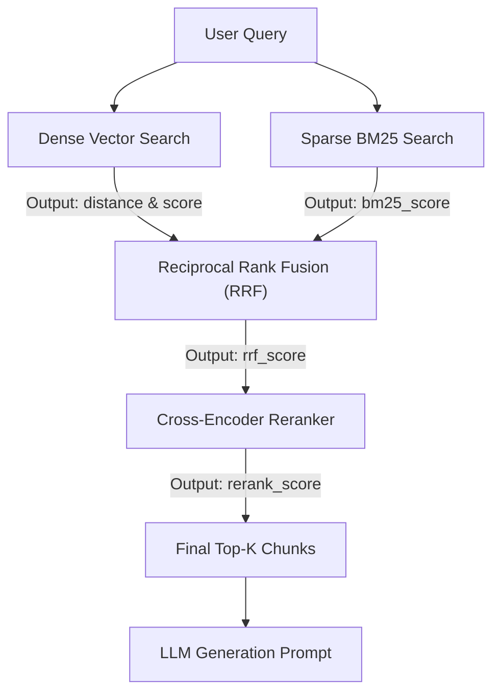

# Retrieval Metrics and Scoring Guide

A comprehensive reference for understanding, tuning, and interpreting the relevance scores and operational KPIs in this RAG pipeline.

---

## 1. Executive Summary

In a modern Hybrid RAG architecture, retrieval is not a single binary lookup. Instead, documents pass through multiple algorithmic layers:
1. **Dense Vector Search** (semantic similarity via embeddings).
2. **Sparse Lexical Search** (exact keyword matching via BM25).
3. **Rank Fusion** (combining disparate scoring spaces via Reciprocal Rank Fusion).
4. **Cross-Encoder Re-Ranking** (deep neural cross-attention over query-chunk pairs).

Each layer outputs its own scoring metric with different mathematical properties, scales, and optimal thresholds.

---

## 2. Master Scoring Reference Table

| Field | Source Component | Algorithm / Mechanism | Typical Range | Ideal Target (Good Result) | Poor / Weak Result |
| :--- | :--- | :--- | :--- | :--- | :--- |
| **`distance`** | **ChromaDB** *(Dense)* | Squared Euclidean distance ($L_2^2$) between normalized embeddings | $[0.0, 4.0]$ | **Close to 0.0**<br>($\le 0.40$ strong match,<br>$\le 0.80$ moderate match) | $> 1.20$<br>(embeddings diverge) |
| **`score`** | **ChromaDB** *(Dense)* | Inverted vector distance:<br>$\text{score} = 1.0 - \text{distance}$ | $(-\infty, 1.0]$ | **Close to 1.0**<br>($\ge 0.60$ strong match) | $< 0.0$<br>(occurs when $\text{distance} > 1.0$) |
| **`bm25_score`** | **BM25Retriever** *(Sparse)* | Okapi BM25 lexical term frequency & inverse document frequency | $[0.0, +\infty)$ | **Higher is better**<br>($> 5.0$ to $20.0+$ depending on query length) | $0.0$<br>(zero lexical keyword overlap) |
| **`rrf_score`** | **HybridRetriever** *(Fusion)* | Reciprocal Rank Fusion combining Dense & Sparse ranks ($k=60$) | $[0.005, 0.035]$ | **Higher is better**<br>($\ge 0.01639$ means Rank 1 in *both* Dense and BM25) | $\le 0.007$<br>(low rank in only one retriever) |
| **`rerank_score`** | **Reranker** *(Cross-Encoder)* | Transformer cross-attention logit (`ms-marco-MiniLM-L-6-v2`) | $(-\infty, +\infty)$<br>*(typically $[-10, +10]$)* | **Positive ($> 0.0$)**<br>($> 2.0$ to $6.0+$ indicates high relevance) | **Negative ($< 0.0$)**<br>(classified as irrelevant candidate) |

---

## 3. Deep-Dive on Individual Metrics

### 3.1 `distance` (Dense Vector Distance)
* **Produced By**: [`src/vectordb/vector_store.py`](file:///C:/GithubProjects/Rag_Full_Version/src/vectordb/vector_store.py) via ChromaDB query.
* **Mathematics**: ChromaDB uses squared Euclidean distance ($L_2^2$) by default. When vector embeddings are unit-normalized (length = 1.0), $L_2^2$ relates directly to cosine similarity:
  $$\text{distance} = \| \vec{u} - \vec{v} \|^2 = 2 - 2 \cdot \cos(\theta)$$
* **Interpretation**:
  * **$0.0$**: Exact duplicate / identical text.
  * **$0.10 - 0.40$**: Strong semantic similarity (paraphrase or close conceptual match).
  * **$0.80 - 1.20$**: Moderate semantic connection.
  * **$> 1.20$**: Weak semantic connection.

---

### 3.2 `score` (Dense Similarity Score)
* **Produced By**: [`src/vectordb/vector_store.py`](file:///C:/GithubProjects/Rag_Full_Version/src/vectordb/vector_store.py).
* **Mathematics**:
  $$\text{score} = 1.0 - \text{distance}$$
* **Important Note**:
  * `score` is **NOT** a BM25 score. It is simply ChromaDB's geometric distance shifted so that higher values represent better matches.
  * When `distance > 1.0`, `score` becomes negative (e.g. `distance = 1.5916` $\implies$ `score = -0.5916`). A negative score simply means the vector distance exceeded the arbitrary unit offset.

---

### 3.3 `bm25_score` (Sparse Keyword Overlap)
* **Produced By**: [`src/retrieval/bm25_retriever.py`](file:///C:/GithubProjects/Rag_Full_Version/src/retrieval/bm25_retriever.py).
* **Mathematics**: Okapi BM25 scoring function:
  $$\text{BM25}(D, Q) = \sum_{t \in Q} \text{IDF}(t) \cdot \frac{f(t, D) \cdot (k_1 + 1)}{f(t, D) + k_1 \cdot \left(1 - b + b \cdot \frac{|D|}{\text{avgdl}}\right)}$$
  *(Default parameters: $k_1 = 1.5$, $b = 0.75$)*
* **Interpretation**:
  * Rewards rare keyword matches (high IDF) and penalizes bloated documents.
  * If a retrieved chunk was fetched solely by Dense search and had no keyword overlap with the query, `bm25_score` will be absent or $0.0$.

---

### 3.4 `rrf_score` (Reciprocal Rank Fusion Score)
* **Produced By**: [`src/retrieval/hybrid_retriever.py`](file:///C:/GithubProjects/Rag_Full_Version/src/retrieval/hybrid_retriever.py).
* **Mathematics**:
  $$\text{RRF}(d) = \sum_{m \in \{\text{dense}, \text{sparse}\}} \frac{\text{weight}_m}{k + \text{rank}_m(d)}$$
  *(Default configuration: $\text{weight}_{\text{dense}} = 0.5$, $\text{weight}_{\text{sparse}} = 0.5$, $k = 60$)*
* **How to Read the Score**:
  * **$0.016394$**: Document was **Rank #1** in both Dense and BM25 ($\frac{0.5}{61} + \frac{0.5}{61}$).
  * **$0.008197$**: Document was **Rank #1** in only *one* of the two search methods ($\frac{0.5}{61} + 0$).
  * Any chunk that surfaces in both retrievers gets boosted substantially above single-retriever candidates.

---

### 3.5 `rerank_score` (Cross-Encoder Neural Relevance)
* **Produced By**: [`src/retrieval/reranker.py`](file:///C:/GithubProjects/Rag_Full_Version/src/retrieval/reranker.py) using `cross-encoder/ms-marco-MiniLM-L-6-v2`.
* **Mechanism**:
  Unlike bi-encoders (which compress documents into independent vectors), the Cross-Encoder feeds the query and chunk text simultaneously into a BERT model with full multi-head cross-attention across all words.
* **Interpretation**:
  * Outputs raw classification logits:
    * **Positive ($> 0.0$)**: The model predicts the passage is **relevant** to the query.
    * **Negative ($< 0.0$)**: The passage is **not relevant**.
  * A score of `+0.51` to `+5.0` indicates strong confidence that the chunk answers the query, regardless of what the initial vector distance was.

---

## 4. Pipeline Dataflow & Metric Origins



---

## 5. Real-World Case Study Analysis

### Scenario: The "Conceptual Match" Query
```json
{
  "distance": 1.5916,
  "score": -0.5916,
  "rrf_score": 0.008197,
  "rerank_score": 0.5126
}
```

#### Step-by-Step Breakdown:
1. **`distance: 1.5916` / `score: -0.5916`**:
   The embedding similarity was mediocre. The query used abstract phrasing that didn't align closely in vector space with the chunk wording.
2. **`rrf_score: 0.008197`**:
   Because $\frac{0.5}{60 + 1} = 0.008197$, this chunk was **Rank #1 in Dense search**, but was **not retrieved by BM25** (no keyword overlap).
3. **`rerank_score: 0.5126`**:
   The Cross-Encoder analyzed the deep semantics of both sentences together, verified factual relevance, and assigned a positive score ($+0.51$).
4. **Conclusion**:
   Hybrid retrieval worked as designed: even though BM25 failed to match keywords and dense distance was mediocre, the Cross-Encoder rescued the chunk and ensured the LLM received the correct ground-truth context.

---

## 6. Operational KPIs

In addition to chunk retrieval scores, the response envelope contains operational KPIs:

* **`trace_id`**: Global unique identifier for the request, directly queryable in [Langfuse](https://cloud.langfuse.com) and application logs.
* **`latency_ms`**: End-to-end wall-clock latency of the entire pipeline in milliseconds.
* **`estimated_cost_usd`**: Dollar cost of LLM token consumption calculated via [`MetricsCollector.estimate_cost()`](file:///C:/GithubProjects/Rag_Full_Version/src/observability/metrics_collector.py#L75-L100).
