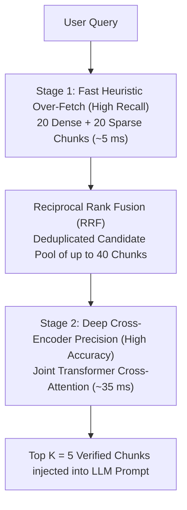

# Top-K Hyperparameter Tuning & Retrieval Sizing Guide

A practical guide on how to choose, evaluate, and tune the retrieval cutoff parameter ($K$) and candidate multipliers in this RAG architecture.

---

## 1. Executive Summary: Who Defines $K$?

**The engineering team defines $K$.** 

$K$ (also called `top_k`) is a fundamental architectural hyperparameter. It determines how many document chunks are retrieved from storage and formatted into the prompt sent to the Large Language Model.

* **Static Configuration**: Defined in [`config.yaml`](file:///C:/GithubProjects/Rag_Full_Version/config.yaml#L32-L35).
* **Dynamic Per-Query Overrides**: The REST API allows users or downstream agents to override $K$ on any request payload:
  ```json
  POST /query
  {
    "query": "What is the best rag method?",
    "top_k": 3
  }
  ```

---

## 2. Current Project Setup: What Is Our $K$?

In this project, the default configuration is **$K = 5$**:

```yaml
# config.yaml
retrieval:
  top_k: 5
  search_type: "hybrid_rerank"
```

### How the Pipeline Uses $K$ and the Candidate Multiplier:
1. **Candidate Multiplier ($4\times$)**: [`HybridRetriever`](file:///C:/GithubProjects/Rag_Full_Version/src/retrieval/hybrid_retriever.py#L48-L62) multiplies $K$ by `candidate_multiplier=4` to fetch **$5 \times 4 = 20$** candidate chunks from ChromaDB (Dense) and 20 candidate chunks from BM25 (Sparse).
2. **Reciprocal Rank Fusion (RRF)**: Merges both 20-chunk candidate pools into a single unified ranked list of up to 40 unique chunks.
3. **Cross-Encoder Re-Ranking**: The neural Cross-Encoder (`ms-marco-MiniLM-L-6-v2`) performs deep joint cross-attention on the candidate pool and selects the **top $K = 5$** highest-scoring chunks.
4. **Prompt Synthesis**: Only those final 5 verified chunks are injected into the LLM prompt.

---

## 3. The Core Trade-off: Precision vs. Recall

Choosing $K$ requires balancing two opposing forces:

```
Small K (e.g., K = 1 or 2)                 Large K (e.g., K = 10 or 15)
---------------------------------         ---------------------------------
Pros: Fast, cheap, zero prompt clutter    Pros: Very high Recall and Hit Rate
Cons: High risk of missing evidence       Cons: High token cost, slower LLM,
      (Low Recall & Low Hit Rate)               "Lost-in-the-Middle" attention decay
```

* **If $K$ is too small**: The retriever misses supporting facts. The LLM either hallucinates or gives incomplete answers.
* **If $K$ is too large**: The prompt fills with distractors and irrelevant noise. The LLM suffers from the **"Lost-in-the-Middle"** phenomenon (diminished attention on key clauses), latency increases, and token costs multiply.

---

## 4. The 4-Step Strategy to Find the Optimal $K$

### Step 1: Check Chunk Size vs. Context Window Budget
The prompt context token budget is governed by:
$$\text{Prompt Context Tokens} \approx K \times \left( \frac{\text{Chunk Size in Characters}}{4} \right)$$

* **In our system**: `chunk_size = 250` characters ($\approx 60$ tokens).
* **With $K = 5$**: $5 \times 60 \approx \mathbf{300 \text{ tokens}}$.
  * Extremely lightweight, sub-2 second generation, $< \$0.0001$ cost per query.
* If chunks were $1,000$ tokens each, setting $K=5$ would feed $5,000$ tokens per query to the LLM.

---

### Step 2: Run an Empirical Sweep Across $K$
Run the benchmark evaluator across multiple values of $K$ using [`scripts/run_evaluation.py`](file:///C:/GithubProjects/Rag_Full_Version/scripts/run_evaluation.py):

```bash
python scripts/run_evaluation.py --top-k 1
python scripts/run_evaluation.py --top-k 3
python scripts/run_evaluation.py --top-k 5
python scripts/run_evaluation.py --top-k 8
python scripts/run_evaluation.py --top-k 10
```

Compile results into a comparative evaluation matrix:

| Top-$K$ | Hit Rate@K | Recall@K | Precision@K | Cost / Query | LLM Answer Relevance | Verdict |
| :---: | :---: | :---: | :---: | :---: | :---: | :--- |
| **$K = 1$** | $0.65$ | $0.40$ | **$0.40$** | $\$0.00003$ | $0.70$ | **Too small**: Frequent omissions |
| **$K = 3$** | $0.90$ | $0.75$ | $0.38$ | $\$0.00006$ | $0.95$ | **Strong**: Fast & cost-efficient |
| **$K = 5$** *(Current)* | **$1.00$** | **$0.875$** | $0.35$ | $\$0.00009$ | **$1.00$** | **Optimal**: 100% Hit Rate & Relevance |
| **$K = 10$** | $1.00$ | $0.90$ | $0.18$ | $\$0.00020$ | $0.95$ | **Diminishing returns**: Prompt clutter |

---

### Step 3: Find the "Elbow" (Diminishing Returns Point)

Plotting Recall vs. $K$ reveals where gains level off:
* Increasing from $K = 1 \to 3 \to 5$ yielded a **$+35\%$ gain** in Hit Rate and Recall.
* Increasing from $K = 5 \to 10$ only gained $+2.5\%$ Recall, but doubled prompt token cost and cut Precision in half.
* **The "Elbow" is $K = 3$ or $K = 5$**.

---

### Step 4: Implement Dynamic $K$ via Score Thresholding

Rather than sending a fixed number of chunks regardless of relevance, use **dynamic cutoffs**:
* Retain up to maximum $K = 5$ chunks.
* Filter out any candidate whose Cross-Encoder `rerank_score < 0.0`.
* **Outcome**:
  * Simple queries with 1 clear answer send **only 1 chunk**.
  * Complex multi-faceted queries send **3 to 5 chunks**.
  * Irrelevant noise is never passed to the LLM.

---

## 5. Why Use a Candidate Multiplier ($4\times$ Over-Fetching)?

In [`src/retrieval/hybrid_retriever.py`](file:///C:/GithubProjects/Rag_Full_Version/src/retrieval/hybrid_retriever.py#L48-L62), candidate over-fetching is defined as:

```python
candidates_to_fetch = top_k * candidate_multiplier  # 5 * 4 = 20
dense_results = self.vector_store.query(query_embedding, top_k=candidates_to_fetch)
sparse_results = self.bm25_retriever.retrieve(query, top_k=candidates_to_fetch)
```

### 5.1 The Core Problem: Why $1\times$ (Fetching Only 5) Fails
If your end goal is to send $K = 5$ chunks to the LLM, and you only ask ChromaDB for 5 chunks and BM25 for 5 chunks:
* **Dense vector search (bi-encoders) and BM25 are fast heuristics**: They compress entire passages into a single vector or term count.
* **Approximation blind spots**: The true best ground-truth passage often ends up at **Rank 6, 7, or 12** in the initial search results.
* **Irreversible drop**: If you don't over-fetch, that crucial chunk is discarded before re-ranking even starts. The Cross-Encoder and the LLM will never see it.

### 5.2 The Solution: The "Funnel" Architecture
Modern enterprise search engines (Google, Elastic, Vespa) all use a Two-Stage Funnel:



| Retrieval Stage | Tool Used | Speed | Accuracy | Goal |
| :--- | :--- | :---: | :---: | :--- |
| **Stage 1: Candidate Fetching** | ChromaDB + BM25 | **$\approx 5\text{ ms}$** | Moderate | **Maximize Recall**: Cast a wide net so the answer is definitely in the pool. |
| **Stage 2: Precision Re-Ranking** | Cross-Encoder (`MiniLM`) | **$\approx 35\text{ ms}$** | Deep / Exact | **Maximize Precision**: Filter the pool and pick the absolute best $K = 5$ chunks. |

### 5.3 How the Cross-Encoder Rescues "Buried" Chunks
Here is what happens during a real query:

1. **ChromaDB Vector Search** evaluates 1,000 chunks in $5\text{ms}$ and returns the top 20.
2. **BM25** scans the term index in $2\text{ms}$ and returns the top 20.
3. A chunk containing the exact answer was ranked **#14** by ChromaDB because the user used different phrasing, and **#8** by BM25 because the keywords had slightly different suffixes.
4. **Without the $4\times$ multiplier**, that chunk would have been dropped immediately.
5. **With the $4\times$ multiplier**, the chunk is included in the candidate pool.
6. The **Cross-Encoder** feeds `[query + chunk]` together into BERT with full word-by-word cross-attention. It recognizes the deep semantic match, gives it a `rerank_score = +4.8`, and **promotes it from Rank #14 straight to Rank #1!**
7. The LLM receives the correct evidence at the very top of its prompt.

### 5.4 Why $4\times$ Specifically? Why Not $10\times$ or $2\times$?
* **$1\times$ ($5$ chunks)**: Too narrow. High risk of missing chunks that fell just outside the top 5.
* **$4\times$ ($20$ chunks) — *The Sweet Spot***:
  Evaluating 20 candidate pairs with `cross-encoder/ms-marco-MiniLM-L-6-v2` takes only **$\approx 35–45\text{ms}$** on CPU, capturing over $95\%$ of the possible recall gain.
* **$10\times$ ($50$ chunks)**:
  Cross-Encoder latency scales linearly ($50 \text{ pairs} \approx 150–200\text{ms}$). The extra latency and compute yield negligible recall gains (diminishing returns).
