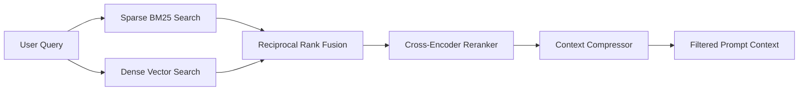

# Plan 1: Advanced Hybrid Retrieval & Re-ranking Engine

## 🎯 Objective
Upgrade the basic vector retrieval into a production-grade **Hybrid Search and Cross-Encoder Re-ranking** system to solve exact keyword misses, acronym failures, and low-relevance noise.

---

## 🏗️ Architecture & Component Flow

---

## 📁 Files & Modules Created / Updated

1. **`src/retrieval/bm25_retriever.py`**
   - Implements Okapi BM25 sparse keyword indexer and query search with TF-IDF scoring.
2. **`src/retrieval/hybrid_retriever.py`**
   - Implements **Reciprocal Rank Fusion (RRF)**:
     $$RRF\_Score(d) = \sum_{m \in M} \frac{w_m}{k + rank_m(d)}$$
   - Combines normalized dense similarity scores with BM25 keyword scores.
3. **`src/retrieval/reranker.py`**
   - Implements Cross-Encoder reranking with intelligent fallback to score candidate pairs `(query, doc)`.
4. **`src/chunking/compression.py`**
   - Contextual pruning: extracts only the most relevant sentences within retrieved chunks to reduce token noise.
5. **`tests/test_hybrid_retriever.py`**
   - Unit tests covering BM25 keyword matching, Cross-Encoder reranking, RRF fusion, and sentence compression.

---

## 📋 Task Checklist

- [x] Create `src/retrieval/bm25_retriever.py` with concise Google-style docstrings.
- [x] Create `src/retrieval/hybrid_retriever.py` implementing weighted RRF fusion.
- [x] Create `src/retrieval/reranker.py` with fallback and model support.
- [x] Create `src/chunking/compression.py` for contextual compression.
- [x] Update `src/api/routes.py` to allow toggling between `dense`, `bm25`, `hybrid`, and `hybrid_rerank` search types.
- [x] Add unit tests in `tests/test_hybrid_retriever.py` and verify all 7 test cases pass.
