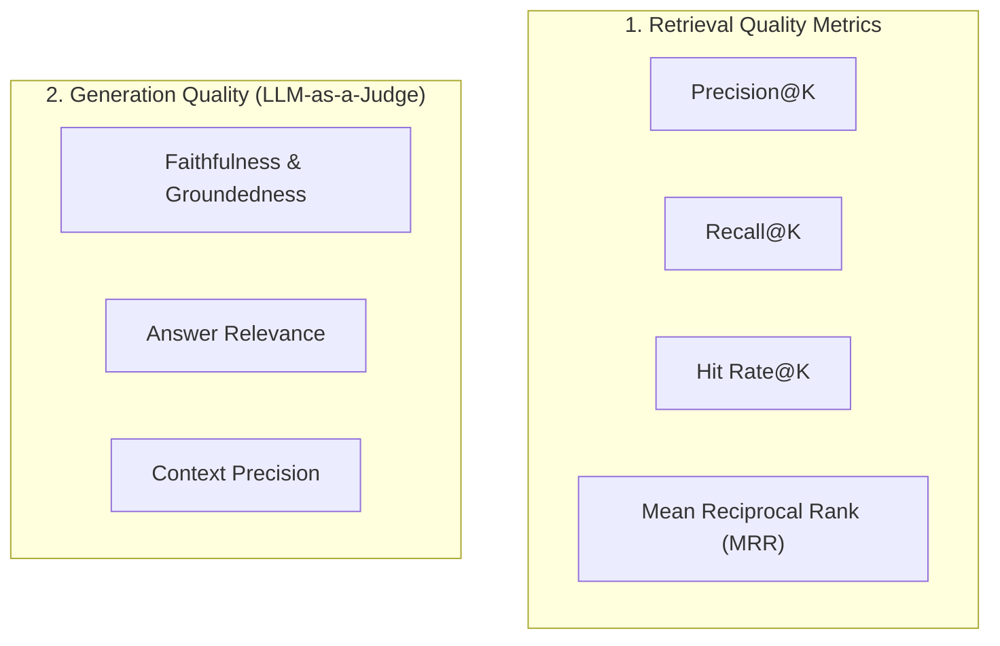

# Plan 2: Evaluation & Metrics Engine (LLM-as-a-Judge)

## 🎯 Objective
Build a comprehensive evaluation framework to measure, monitor, and mathematically validate retrieval accuracy and generation quality (answering: *"How do you know your RAG system improved?"*).

---

## 🏗️ Architecture & Metric Taxonomy

---

## 📁 Files & Modules to Create

1. **`src/evaluation/retrieval_metrics.py`**
   - Formulas and functions for `compute_precision_at_k()`, `compute_recall_at_k()`, `compute_hit_rate()`, and `compute_mrr()`.
2. **`src/evaluation/generation_metrics.py`**
   - LLM-as-a-Judge evaluators for `Faithfulness` (extract statements and verify against context) and `Answer Relevance`.
3. **`src/evaluation/evaluator.py`**
   - Central runner orchestrating batch evaluation over a golden dataset.
4. **`data/eval/golden_dataset.json`**
   - Evaluation dataset containing `(query, ground_truth_context, ground_truth_answer)`.
5. **`tests/eval_benchmark.py`**
   - Automated benchmark test generating a markdown evaluation scorecard.

---

## 📋 Task Checklist

- [ ] Implement mathematical retrieval metrics in `src/evaluation/retrieval_metrics.py`.
- [ ] Implement LLM-as-a-Judge evaluation prompt & logic in `src/evaluation/generation_metrics.py`.
- [ ] Create `data/eval/golden_dataset.json` with domain test queries.
- [ ] Create `src/evaluation/evaluator.py` to calculate aggregate scorecards (0.0 to 1.0).
- [ ] Add CLI/test runner `tests/eval_benchmark.py` that outputs comparative benchmark tables.
