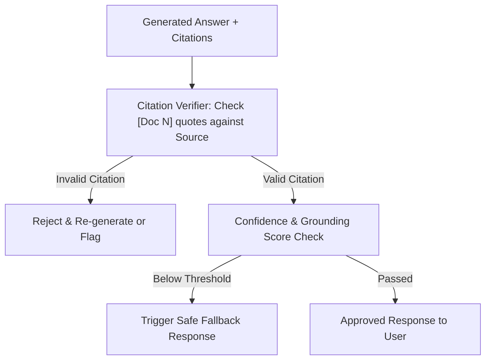

# Plan 3: Failure Modes, Guardrails & Hallucination Prevention

## 🎯 Objective
Eliminate hallucinations, verify factual grounding with strict citation enforcement, and handle edge cases gracefully (answering: *"What do you do if your RAG chatbot starts hallucinating?"*).

---

## 🏗️ Guardrail Pipeline Flow

---

## 📁 Files & Modules to Create

1. **`src/guardrails/citation_verifier.py`**
   - Parses inline citation markers `[1]`, `[Source: file.pdf]` from generated text and verifies that the cited text actually exists in the retrieved context chunk.
2. **`src/guardrails/hallucination_detector.py`**
   - Statement-level entailment checking (NLI / prompt-based) to verify that generated assertions are strictly entailed by the context.
3. **`src/guardrails/fallback_handler.py`**
   - Standardized, safe fallback response handler when retrieval confidence is too low or context is missing.
4. **`tests/test_guardrails.py`**
   - Unit tests checking detection of ungrounded statements and fake citations.

---

## 📋 Task Checklist

- [ ] Create `src/guardrails/citation_verifier.py` with regex citation parser and source matcher.
- [ ] Create `src/guardrails/hallucination_detector.py` for claim-level verification.
- [ ] Create `src/guardrails/fallback_handler.py` with configurable fallback thresholds.
- [ ] Integrate guardrail checks into `src/api/routes.py` pipeline.
- [ ] Add unit tests in `tests/test_guardrails.py`.
