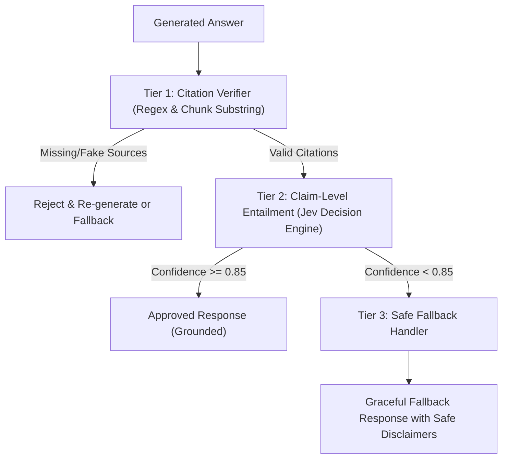

# Plan 3: Failure Modes, Guardrails & Hallucination Prevention

## 🎯 Objective
Eliminate hallucinations, verify factual grounding with strict citation enforcement, and handle edge cases gracefully using high-speed, cost-efficient discriminative guardrails (answering: *"What do you do if your RAG chatbot starts hallucinating?"*).

---

## 💡 Strategic Decision: Discriminative Decision Model (Jev) vs Generative LLM

Using a standard generative LLM (Mistral, GPT-4o, Claude) as an inline guardrail is a major production anti-pattern:
- **Latency Penalty:** Generative LLMs take 1,500–3,500 ms to generate critique text and JSON, doubling user wait time.
- **Cost Inefficiency:** Generative evaluation costs $0.15–$5.00+ per 1M tokens.
- **Schema Drift & Parsing Failures:** Generative outputs can violate formatting constraints or hallucinate in their own justifications.

### Why Jev (TypeSafe AI / OpenRouter) is Ideal for Plan 3:
1. **Ultra-Low Cost:** ~$0.042 per 1M input tokens with free/unmetered output tokens (over 90% cheaper than generative judge models).
2. **Sub-Second Latency:** 70–500 ms inference, fitting comfortably within real-time SLA budgets (<1s total pipeline).
3. **Discriminative Output:** Evaluates claims against context and produces calibrated binary/categorical probabilities (`is_entailed: bool`, `confidence: float`) rather than unstructured prose, eliminating JSON formatting failures.
4. **Pluggable Fallback:** Supports seamless fallback to local NLI cross-encoders or standard LLM prompts if Jev credentials are not configured.

---

## 🏗️ Multi-Tier Guardrail Pipeline Flow



---

## 📁 Files & Modules to Create

1. **`src/guardrails/jev_client.py`**
   - High-throughput client for TypeSafe AI / OpenRouter Jev decision endpoints.
   - Evaluates input claims against retrieved context chunks with calibrated confidence scoring.
   - Built-in retry handling and latency tracking.

2. **`src/guardrails/citation_verifier.py`**
   - Tier 1 deterministic verifier.
   - Parses inline citation markers `[1]`, `[Source: file.pdf]` from generated text and verifies that cited excerpts strictly exist in retrieved context chunks without LLM overhead.

3. **`src/guardrails/hallucination_detector.py`**
   - Tier 2 claim-level grounding verifier.
   - Extracts factual propositions from generated answers and queries **Jev** for NLI entailment against the source context.
   - Provides graceful fallback to local heuristic/LLM judge if `JEV_API_KEY` is unavailable.

4. **`src/guardrails/fallback_handler.py`**
   - Standardized, safe fallback response handler when retrieval confidence is too low or context is missing.
   - Provides deterministic disclaimer templates and configurable threshold triggers.

5. **`tests/test_guardrails.py`**
   - Unit and integration tests checking citation verification, Jev entailment responses, ungrounded claim detection, and fallback routing.

---

## ⚙️ Configuration Updates (`config.yaml`)

```yaml
guardrails:
  enabled: true
  citation_enforcement: true
  entailment_engine: "jev" # Options: jev, llm_judge, mock
  jev:
    model: "typesafe/jev"
    api_base: "https://api.typesafe.ai/v1" # or OpenRouter endpoint
    confidence_threshold: 0.85
    timeout_ms: 1000
  fallback:
    strict_mode: true
    fallback_message: "I cannot find sufficient factual backing in the retrieved documents to answer this reliably."
```

---

## 📋 Task Checklist

- [x] Create `src/guardrails/jev_client.py` for high-speed discriminative verification calls.
- [x] Create `src/guardrails/citation_verifier.py` with regex citation parser and source chunk cross-checker.
- [x] Create `src/guardrails/hallucination_detector.py` orchestrating Jev claim entailment with pluggable fallbacks.
- [x] Create `src/guardrails/fallback_handler.py` with configurable confidence thresholds.
- [x] Add `guardrails` configuration block to `config.yaml` and `.env.example`.
- [x] Integrate guardrail checks into `src/api/routes.py` pipeline.
- [x] Add unit tests in `tests/test_guardrails.py` with mocked Jev responses and hallucinated scenarios.

