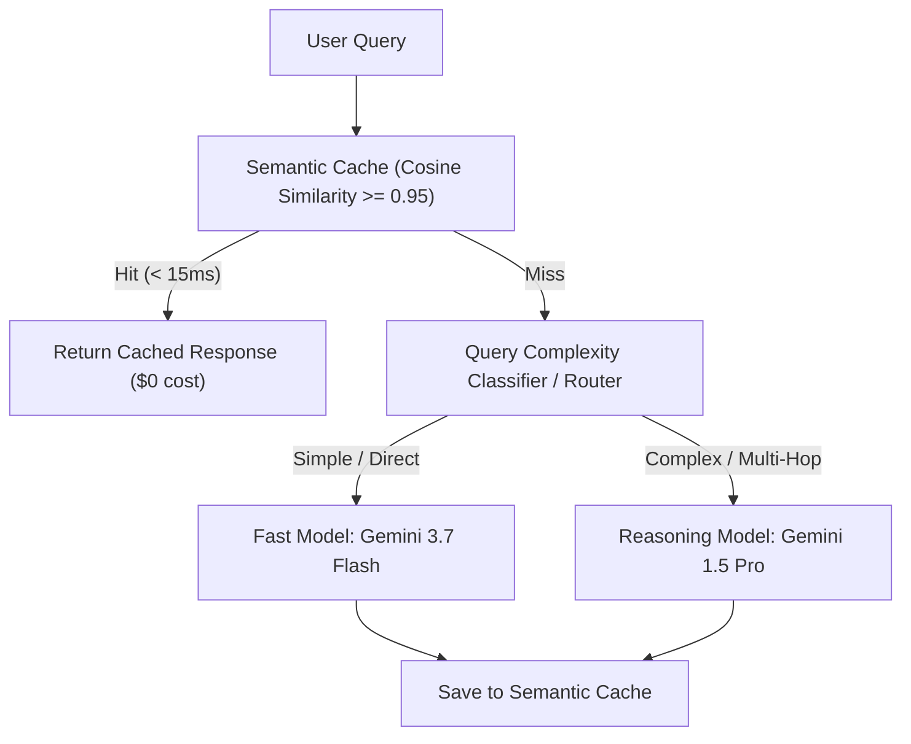

# Plan 4: Cost & Latency Optimization

## 🎯 Objective
Minimize LLM token spend, reduce end-to-end P95 response latency, and intelligently route queries (answering: *"How do you reduce AI costs without hurting quality?"*).

---

## 🏗️ Optimization Architecture

---

## 📁 Files & Modules to Create

1. **`src/optimization/semantic_cache.py`**
   - Vector-based semantic query cache using cosine similarity threshold (e.g. 0.95) with TTL expiration.
2. **`src/optimization/query_router.py`**
   - Classifies queries into simple single-hop factoid queries vs. complex multi-document synthesis queries.
3. **`src/optimization/profiler.py`**
   - End-to-end performance profiler measuring latency (ms) and token consumption per stage:
     - `ingestion_time_ms`
     - `retrieval_time_ms`
     - `rerank_time_ms`
     - `llm_generation_time_ms`
     - `total_cost_usd`
4. **`tests/test_optimization.py`**
   - Unit tests verifying cache hits for semantically equivalent queries and latency tracking.

---

## 📋 Task Checklist

- [ ] Implement `src/optimization/semantic_cache.py` with vector similarity lookup.
- [ ] Implement `src/optimization/query_router.py` with heuristic and model-based classification.
- [ ] Implement `src/optimization/profiler.py` with timing decorators and token counters.
- [ ] Add latency and cost metadata to `/query` response in `src/api/routes.py`.
- [ ] Add unit tests in `tests/test_optimization.py`.
