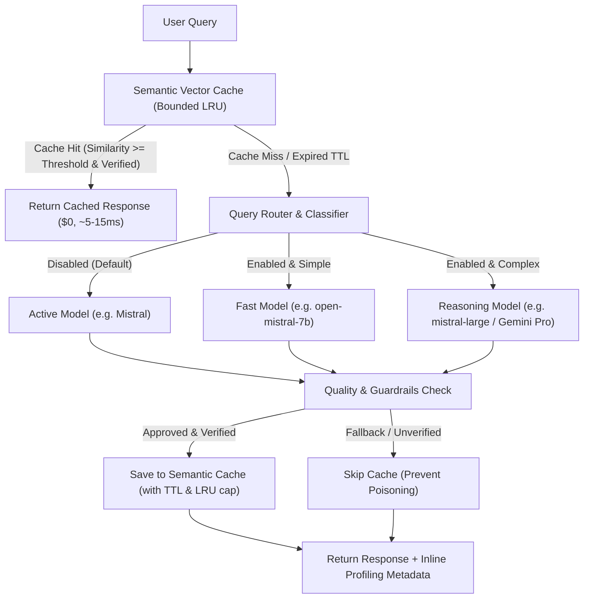

# Plan 4: Cost & Latency Optimization

## 🎯 Objective
Minimize LLM token spend, reduce end-to-end P95 response latency, and intelligently route queries without memory bloat or cache poisoning (answering: *"How do you reduce AI costs without hurting quality?"*).

---

## 🏗️ Optimization Architecture

---

## 📁 Files & Modules

1. **`src/optimization/semantic_cache.py`**
   - Bounded vector-based semantic cache with cosine similarity matching (`threshold=0.95`).
   - LRU eviction (`max_entries` limit) to prevent memory leaks.
   - TTL expiration and selective caching policy (excludes fallbacks, refusals, and unverified answers).
2. **`src/optimization/query_router.py`**
   - Config-driven routing toggle (`enabled: false` by default for single-model deployments like Mistral).
   - Heuristic complexity classifier (single-hop factoid vs. multi-document synthesis) when enabled.
3. **`src/optimization/profiler.py`**
   - Unified latency and token cost profiler extracting stage-level metrics from active `TraceContext` and `MetricsCollector`:
     - `retrieval_ms`, `rerank_ms`, `generation_ms`, `guardrail_ms`, `total_latency_ms`, `estimated_cost_usd`.
4. **`src/api/routes.py`**
   - Integrated semantic cache lookup prior to retrieval.
   - Inline `profiling` breakdown attached to `/query` response payloads.
5. **`tests/test_optimization.py`**
   - Unit and integration tests verifying cache hits/misses, LRU eviction, TTL expiry, refusal filtering, router config toggling, and profiler stage reporting.

---

## 📋 Task Checklist

- [x] Add `optimization` section in `config.yaml` (cache limits + router toggle).
- [x] Implement `src/optimization/semantic_cache.py` with LRU eviction and quality-gate filtering.
- [x] Implement `src/optimization/query_router.py` with config enable/disable toggle.
- [x] Implement `src/optimization/profiler.py` bridging tracing spans and cost estimation.
- [x] Integrate caching and inline profiling into `/query` in `src/api/routes.py`.
- [x] Add comprehensive tests in `tests/test_optimization.py` and verify all tests pass.

