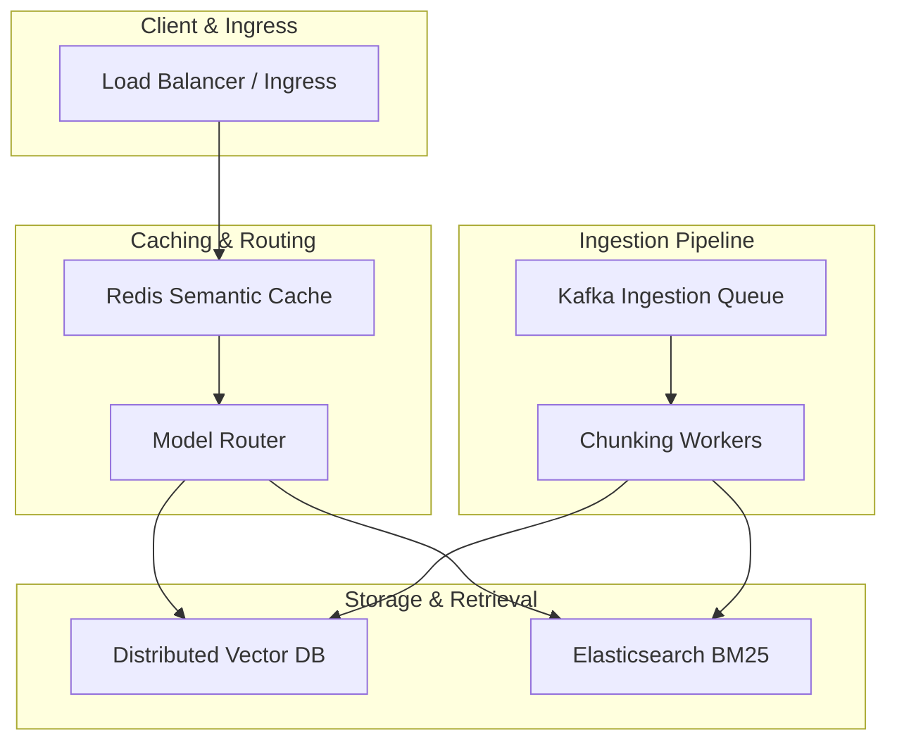

# Plan 5: System Design, Scaling (100x), and Interview Playbook (ADRs)

## 🎯 Objective
Document architectural tradeoffs, scalability bottlenecks at 100x volume, and decision-making frameworks (answering: *"Why RAG over fine-tuning?"* and *"What breaks first at 100x scale?"*).

---

## 🏗️ 100x Scale Architecture Blueprint

---

## 📁 Files & Documentation to Create

1. **`docs/ADR/001_rag_vs_fine_tuning.md`**
   - Detailed comparison matrix: Dynamic updates vs domain styling, data privacy, hallucinations, and maintenance cost.
2. **`docs/ADR/002_scaling_at_100x.md`**
   - Failure analysis at 100x:
     - Vector Index RAM exhaustion $\rightarrow$ HNSW index quantization (Product Quantization / Scalar Quantization).
     - Ingestion bottleneck $\rightarrow$ Async event-driven queue (Kafka/Celery) with batch embedding workers.
     - Rate limits & LLM concurrency $\rightarrow$ Tiered token pooling and backoff retries.
3. **`docs/ADR/003_chunking_and_retrieval_tradeoffs.md`**
   - Ablation analysis of chunk sizes (256 vs 512 vs 1024), overlaps, and Hybrid RRF vs Single Vector Search.
4. **`docs/ADR/004_in_memory_vs_persistent_bm25.md`**
   - Architectural Tradeoff: In-Memory Python BM25 vs. Persistent Inverted Indexes (SQLite FTS5, Tantivy, Qdrant/Weaviate Native Hybrid, Elasticsearch):
     - **The Bottleneck**: $O(N)$ RAM exhaustion, cold-start index wipe upon server restarts, and multi-worker process desynchronization (`uvicorn --workers N`).
     - **Production Evolution**: When to use embedded disk-backed engines (SQLite FTS5 / Tantivy) vs. native hybrid vector databases (Qdrant / Weaviate) vs. distributed clusters (Elasticsearch / OpenSearch).
5. **`docs/INTERVIEW_CHEAT_SHEET.md`**
   - Comprehensive answers and talking points for the top 10 senior AI engineer interview scenarios (including in-memory state scaling traps).

---

## 📋 Task Checklist

- [ ] Create `docs/ADR/` directory.
- [ ] Write `docs/ADR/001_rag_vs_fine_tuning.md`.
- [ ] Write `docs/ADR/002_scaling_at_100x.md`.
- [ ] Write `docs/ADR/003_chunking_and_retrieval_tradeoffs.md`.
- [ ] Write `docs/ADR/004_in_memory_vs_persistent_bm25.md`.
- [ ] Write `docs/INTERVIEW_CHEAT_SHEET.md`.
