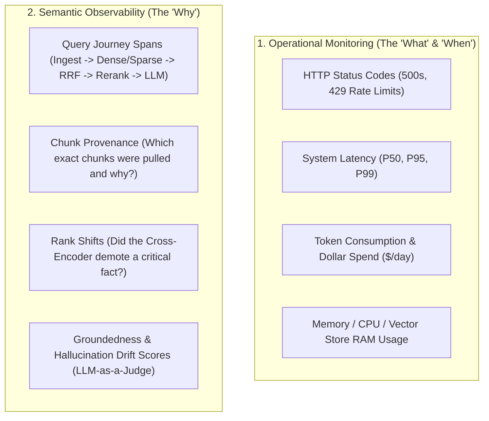
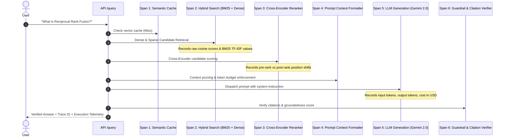

# Plan 6: Observability vs. Monitoring in Production RAG

## 🎯 Objective
Design and implement a unified **Monitoring & Semantic Observability** layer for the RAG pipeline. Traditional APM tools only monitor crashes, but RAG applications fail silently (returning `HTTP 200 OK` with confident hallucinations). This plan establishes end-to-end distributed tracing, token/cost accounting, and semantic health inspection.

---

## 🔍 Monitoring vs. Observability: The RAG Dilemma

---

## 📊 Core Comparison Matrix

| Dimension | **Monitoring (Operational Health)** | **Observability (Semantic & Reasoning Health)** |
| :--- | :--- | :--- |
| **Core Question** | *"Is the system alive, fast, and within budget?"* | *"Why did the system give an incorrect or hallucinated answer?"* |
| **Nature** | **Reactive**: Triggers alerts on metric breaches (known-knowns). | **Investigative / Proactive**: Inspects execution graphs & silent failures (unknown-unknowns). |
| **Data Types** | Aggregated time-series counters, gauge metrics, error stacks. | Correlated distributed traces, span metadata, prompt payloads, chunk scores. |
| **Typical Failure** | HTTP 504 Gateway Timeout, Out of Memory (OOM), API Quota 429. | **Silent Failure**: HTTP 200 OK returned, but retrieved wrong context or hallucinated citations. |
| **Standard Tools** | Prometheus, Grafana, Sentry, Datadog. | **Langfuse**, **Arize Phoenix**, **OpenTelemetry (OTel)**, Braintrust. |

---

## 🏗️ Architecture: Distributed Tracing & Span Anatomy

Every `/query` request creates a root trace with child spans recording input, output, duration, and score metadata:

---

## 📁 Files & Modules to Create

1. **`src/observability/tracer.py`**
   - Lightweight, dependency-free OpenTelemetry-compatible span tracer to track query life cycles with context managers (`with tracer.span("rerank"): ...`).
2. **`src/observability/metrics_collector.py`**
   - Tracks operational counters: P50/P95 latency, total requests, cache hit ratio, token usage per model, and cumulative dollar cost.
3. **`src/observability/span_exporter.py`**
   - Exporter interface supporting structured local JSONL audit logs and pluggable export to **Langfuse** / **Arize Phoenix** / **OpenTelemetry Collector**.
4. **`docs/OBSERVABILITY_VS_MONITORING.md`**
   - In-depth architectural guide for senior engineering interviews and team onboarding.
5. **`tests/test_observability.py`**
   - Unit tests verifying span creation, latency measurement, cost calculation, and trace serialization.

---

## 📋 Task Checklist

- [ ] Create `src/observability/__init__.py`.
- [ ] Create `src/observability/tracer.py` with span context manager and trace ID generator.
- [ ] Create `src/observability/metrics_collector.py` with token cost estimation formulas (Gemini/OpenAI/Claude rates).
- [ ] Create `src/observability/span_exporter.py` for structured local trace persistence.
- [ ] Write `docs/OBSERVABILITY_VS_MONITORING.md` explaining operational vs semantic observability.
- [ ] Integrate tracing into `src/api/routes.py` so every response returns an `x-trace-id` header and execution telemetry.
- [ ] Add unit tests in `tests/test_observability.py`.
- [ ] Update `README.md` with Plan 6.
